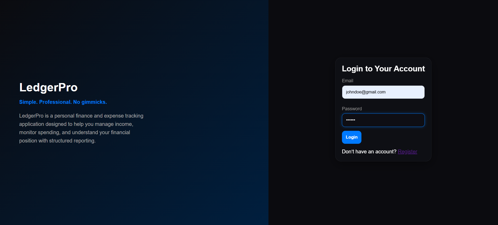
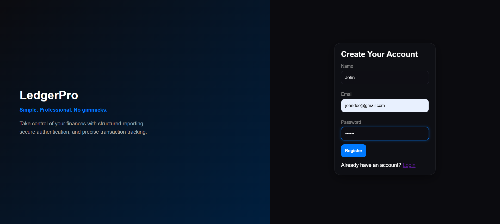
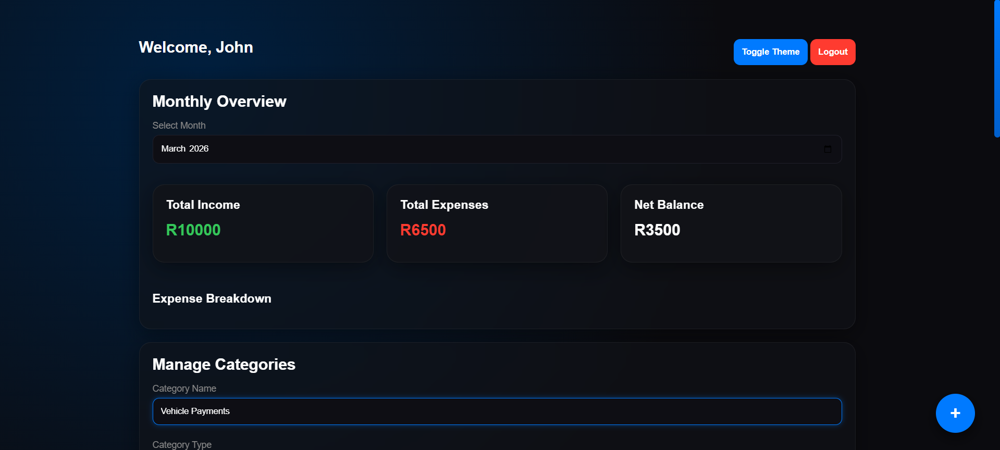
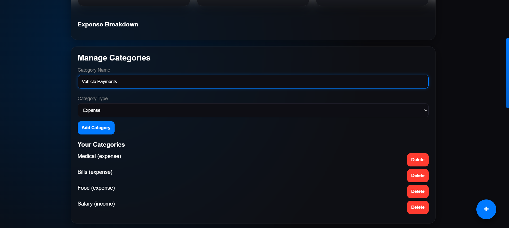
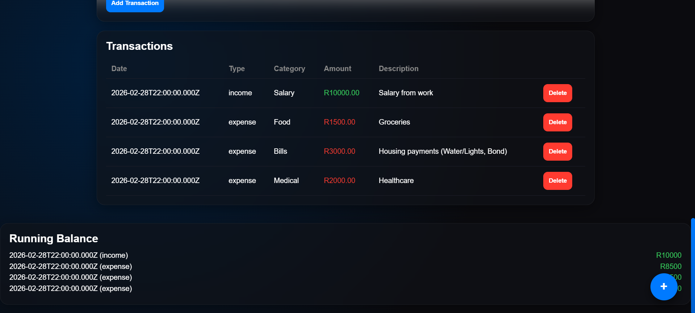
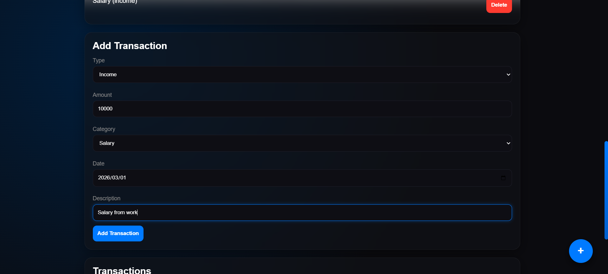

# LedgerPro

**Simple. Professional. No gimmicks.**

LedgerPro is a full-stack personal finance and expense tracking application built to demonstrate production-level backend architecture, relational data modeling, and financial reporting logic.

This project goes beyond basic CRUD applications by implementing aggregation queries, derived financial calculations, ownership enforcement, and structured reporting endpoints.

Live Link: https://ledgerprov1.netlify.app/

---

## 📸 Screenshots

### 🔐 Login Page


---

### 📝 Register Page


---

### 📊 Dashboard Overview


---

### 🗂 Category Management


---

### 💳 Transactions Table


---

### 📈 Add Transactions


---

## 🚀 Features

### 🔐 Authentication
- Secure JWT-based authentication
- Password hashing using bcrypt
- Protected API routes
- User-specific data isolation

### 💰 Transaction Management
- Create income & expense transactions
- Relational category linking
- Date-based filtering
- Type-based filtering
- Secure ownership enforcement

### 📊 Financial Reporting (Advanced SQL)
- Monthly summary endpoint
- Category breakdown (GROUP BY + JOIN)
- Running balance calculation
- Derived financial metrics
- Aggregation using SUM + CASE WHEN
- PostgreSQL DATE_TRUNC filtering

### 🎨 Frontend
- Modern Apple-inspired UI
- Glassmorphism styling
- Smooth animations & transitions
- Responsive mobile layout
- Animated financial metrics
- Light / Dark theme toggle
- Micro-interactions (ripple effect)

---

## 🧠 What This Project Demonstrates

This project was built to prove competency in:

- Relational database design
- Foreign key modeling
- Business rule enforcement
- Aggregation queries
- Financial precision using NUMERIC
- Secure backend architecture
- Dynamic query building
- Algorithmic running balance computation
- Clean MVC backend structure
- Full-stack integration

This moves beyond a typical "Todo App" and demonstrates backend capability expected in junior-to-mid level roles.

---

## 🏗 Tech Stack

### Frontend
- HTML
- CSS (Glassmorphism + animations)
- Vanilla JavaScript

### Backend
- Node.js
- Express.js
- PostgreSQL
- JWT Authentication
- bcrypt

### Deployment
- Backend: Render
- Frontend: Netlify

---

## 🗂 Project Structure

```
ledgerpro/
│
├── client/                 # Frontend
│   ├── index.html
│   ├── login.html
│   ├── register.html
│   ├── css/
│   └── js/
│
└── server/                 # Backend
    ├── routes/
    ├── controllers/
    ├── models/
    ├── middleware/
    ├── config/
    └── app.js
```

---

## 🗄 Database Schema

### Users
- id (PK)
- name
- email (unique)
- password (hashed)
- created_at

### Categories
- id (PK)
- user_id (FK → users)
- name
- type (income | expense)
- created_at

### Transactions
- id (PK)
- user_id (FK → users)
- type (income | expense)
- amount (NUMERIC(12,2))
- category_id (FK → categories)
- description
- date
- created_at

---

## 📈 Example Reporting Endpoint

### Monthly Summary

```
GET /api/reports/monthly?month=2026-02
```

Returns:

```json
{
  "totalIncome": 5200,
  "totalExpenses": 3100,
  "netBalance": 2100
}
```

Implemented using:

- SUM()
- CASE WHEN
- DATE_TRUNC
- Derived calculations

---

## ⚙️ Local Setup Instructions

### 1️⃣ Clone Repository

```
git clone https://github.com/yourusername/ledgerpro.git
cd ledgerpro
```

---

### 2️⃣ Backend Setup

```
cd server
npm install
```

Create `.env` file:

```
PORT=5000

DB_USER=postgres
DB_HOST=localhost
DB_NAME=ledgerpro
DB_PASSWORD=yourpassword
DB_PORT=5432

JWT_SECRET=your_jwt_secret
```

Run:

```
npm run dev
```

---

### 3️⃣ Database Setup

Create PostgreSQL database:

```
CREATE DATABASE ledgerpro;
```

Run the schema SQL provided in the project.

---

### 4️⃣ Frontend Setup

Open:

```
client/login.html
```

in browser.

Or deploy via Netlify.

---

## 🔒 Security Notes

- Passwords hashed with bcrypt
- JWT expiration enforced
- SQL injection prevention via parameterized queries
- Ownership enforcement at SQL level
- Type validation at database and controller level

---

## 📌 Future Improvements

- Pagination
- Chart visualizations
- Budget tracking
- CSV export
- Multi-currency support
- Unit tests
- Dockerization

---

## 👤 Author

Built as a portfolio project to demonstrate backend capability, financial data modeling, and reporting logic.

---